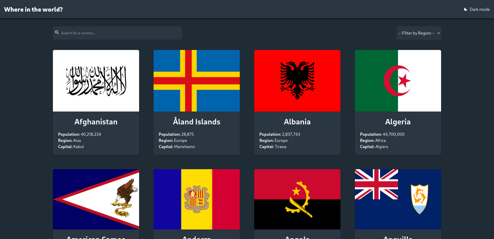
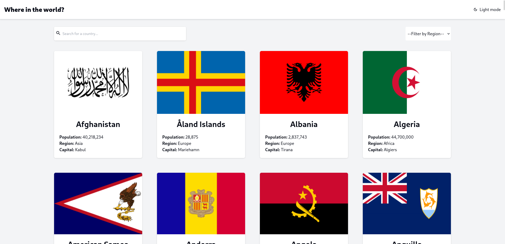

# Frontend Mentor - REST Countries API with color theme switcher solution

This is a solution to the [REST Countries API with color theme switcher challenge on Frontend Mentor](https://www.frontendmentor.io/challenges/rest-countries-api-with-color-theme-switcher-5cacc469fec04111f7b848ca). Frontend Mentor challenges help you improve your coding skills by building realistic projects.

## Table of contents

- [Frontend Mentor - REST Countries API with color theme switcher solution](#frontend-mentor---rest-countries-api-with-color-theme-switcher-solution)
  - [Table of contents](#table-of-contents)
  - [Overview](#overview)
    - [The challenge](#the-challenge)
    - [Screenshot](#screenshot)
    - [Links](#links)
  - [My process](#my-process)
    - [Built with](#built-with)
    - [What I learned](#what-i-learned)
    - [Useful resources](#useful-resources)
  - [Author](#author)

## Overview

### The challenge

Users should be able to:

-   See all countries from the API on the homepage
-   Search for a country using an `input` field
-   Filter countries by region
-   Click on a country to see more detailed information on a separate page
-   Click through to the border countries on the detail page
-   Toggle the color scheme between light and dark mode _(optional)_

### Screenshot

-   Country Filter:

<table>
<tr>
  <th>Dark Mode</th>
  <th>Light Mode</th>
</tr>
<tr>
  <td></td>
  <td></td>
</tr>
<table>

-   Country Details:

<table>
<tr>
  <th>Dark Mode</th>
  <th>Light Mode</th>
</tr>
<tr>
  <td></td>
  <td></td>
</tr>
<table>

### Links

-   [Solution URL](https://www.frontendmentor.io/solutions/countries-rest-api-challenge-POej-yzEZU)
-   [Live Site URL](https://countries-rest-api-challenge-eight.vercel.app/)

## My process

### Built with

-   Semantic HTML5 markup
-   Flexbox
-   CSS Grid
-   Mobile-first workflow
-   [Tailwind](https://tailwindcss.com/) - CSS framework
-   [React](https://reactjs.org/) - JS library

### What I learned

-   Put React.js knowledge to practice
-   Basic ESLint and PostCSS configuration
-   Tailwind CSS
-   Deployment to Vercel
-   Fetching data from an API
-   Routing with React Router
-   Manual pagination
-   Custom hooks

### Useful resources

-   [Tailwind Docs](https://tailwindcss.com/docs/installation) - Served as a nice reference to search for specific classes and how to switch between dark and light mode correctly.

## Author

-   Frontend Mentor - [@GPMS](https://www.frontendmentor.io/profile/GPMS)
